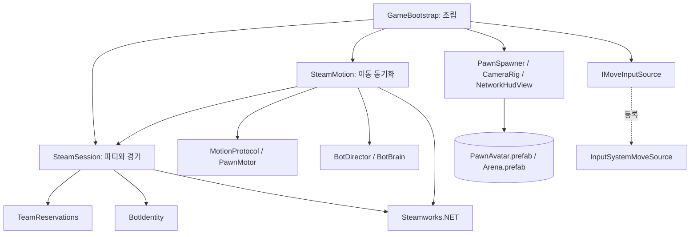
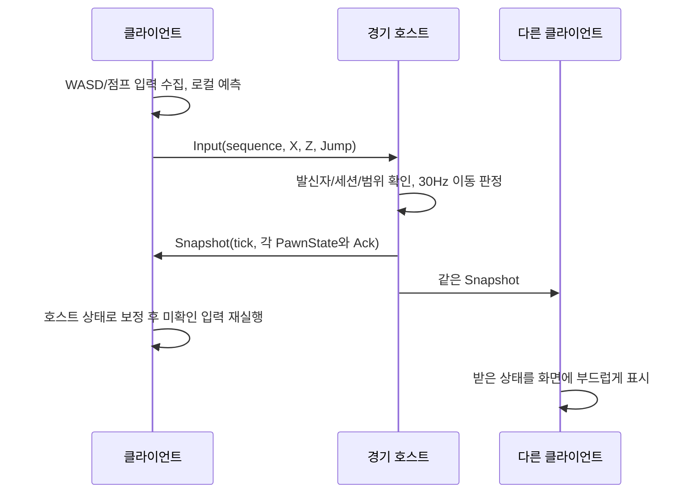

# ChessFight Network — AI·개발자 인수인계

작성일: 2026-09-22 (KST) — 구조 개편·AI 봇 반영

코드 기준: `Network` 브랜치 HEAD

저장소: https://github.com/dua0731-cmd/ChessFight

이 문서는 이미 구현된 Steam 파티·기본 자동 매칭·이동 테스트를 다른 개발자나 Claude Code 등의 AI가 이어받기 위한 설명이다. **기존 구현을 새로 만들 필요는 없다.** 실제 구현과 제품의 장기 목표, 확인된 결과와 미검증 사항을 구분한다. 코드는 위 커밋을 기준으로 직접 읽고 작성했다. 이후 코드가 변경되었다면 코드와 최신 검증 기록을 우선한다.

## 1. 가장 먼저 알아야 할 현재 상태

- 게임 전체는 체스 말 6종을 사용하는 6대6 팀 파티 게임을 목표로 한다. 현재 구현은 **네트워크 접속과 캡슐 이동만 확인하는 기술 프로토타입**이다.
- 전용 게임 서버와 별도 유료 매칭 서버는 없다. Steam 로비로 파티와 경기 방을 구성하고, 경기 방을 만든 플레이어의 PC가 이동을 판정하는 호스트가 된다.
- 파티 로비는 최대 6명, 경기 로비는 최대 12명이다. 한 파티를 양 팀으로 나누지 않는다.
- 공개 자동 매칭은 12명이 모두 입장해야 시작한다. 비공개 테스트는 1명만 있어도 생성·이동이 가능하며, 2명 이상 입장 완료 시 시작 버튼으로 입장을 마감할 수 있다.
- `StartGame`은 현재 로비를 `playing` 상태로 바꾸고 추가 입장을 잠근다. 킹러시 시작, 씬 전환, 카운트다운, 승패 처리는 없다.
- `ChessFight > Network > Open test scene`으로 `ChessFightLab`을 열고 Play한다. 체스판·캡슐·HUD는 **프리팹/UXML 자산이며 Play 중에 Instantiate된다.** 편집 모드에 카메라와 `ChessFight Game Root`만 보이는 것은 정상이다.
- 2026-09-21 실제 Unity에서 패키지 설치, 컴파일, Steam 파티 생성, 비공개 방 입장, 파란 캡슐 생성을 확인했고 Windows 개발 빌드가 성공했다.
- 2026-09-22 독립 실행 빌드의 체스판·UI 표시, Steam 미실행 시 초기화 오류, 로그인 후 재시작 시 1인 파티·비공개 경기·BLUE 캡슐 생성을 확인했다.
- 2026-09-22 **두 PC·두 Steam 계정의 파티 입장과, 각자 1인 파티에서 Quick match를 눌러 서로 같은 경기 방에 수렴하는 것까지 확인했다(사용자 보고).** 그 상태에서 양방향 이동·점프가 보였는지는 보고되지 않았다.
- 2026-09-22 **구조 개편과 AI 봇을 추가했다. 이 변경분은 Unity에서 한 번도 실행하지 않았다.** 아래 2.5절을 먼저 읽는다.

### 중요한 커밋

| 커밋 | 내용 |
|---|---|
| `5af7c8ccaef73a894ba4a2a64c73e113934865db` | 네트워크 구현 전 기준. 템플릿 씬·기본 환경 |
| `87805f00abaa1293cc71b169a4a3cc0831d1d45e` | 파티, 기본 매칭, 이동 동기화, 테스트 UI, 테스트 도구 추가 |
| `c9c1e6af50548a8161d10f8754b9a9897a38b3ac` | 실제 UPM 설치 결과인 manifest/lock, Steamworks define, 폴더 메타데이터 반영 |

## 2. 제품 맥락과 현재 구현의 경계

팀은 기획자 1명, 프로그래머 1명, 서브 기획·프로그래머 2명, 3D 그래픽 1명으로 총 5명이며 개발 기간은 약 12주다. Unity/C#에 익숙하고 별도 서버 운영비가 거의 없다. 그래서 Steamworks 기반을 기본안으로 선택했다.

장기 제품 구상은 킹·퀸·룩·비숍·나이트·폰을 팀당 한 명씩 맡고 여러 미니게임 라운드를 진행하는 구조다. 말별 스킬은 게임 모드마다 고정된 구성을 갖게 할 예정이다. 이는 **제품 기획**이며 현재 네트워크 코드에 기물 선택·스킬·라운드 로직이 구현되어 있다는 뜻은 아니다.

현재 없는 기능: 킹러시 경주 규칙, 기물 선택 및 중복 제한, 6종 스킬, 체력·전투·래그돌, 장애물 충돌 이동, 라운드 점수, 승패, 봇, MMR·랭크, 전용 서버, 호스트 이전, 재접속 복구, 서버 기반 안티치트. Photon, Mirror, Netcode for GameObjects, Unity Relay/Lobby/Matchmaker도 현재 사용하지 않는다. `Multiplayer Center` 패키지가 있다는 이유로 UGS 연결이 구현되었다고 판단하면 안 된다.

## 2.5. 2026-09-22 변경 — 구조 개편과 AI 봇

**기존 네트워크 규칙은 바꾸지 않았다.** 예약·매칭·패킷 포맷·권한 모델은 그대로다. 바뀐 것은 표현 계층과 인원 채우기다.

### 표현 계층을 자산으로 분리

`Assets/ChessFight/Network/Runtime/NetworkSandbox.cs`를 **삭제**하고 `Assets/ChessFight/Game/`로 옮겼다.

| 이전 | 이후 |
|---|---|
| `GameObject.CreatePrimitive`로 캡슐·타일 생성 | `PawnAvatar.prefab`, `Arena.prefab` |
| `new Material(...)` 런타임 생성 | `TeamBlue/TeamOrange/BoardDark/BoardLight.mat` |
| `Input.GetKey` (Legacy) | `ChessFightControls.inputactions` + Input System |
| 한 클래스가 UI·세션·표시·입력 전부 담당 | `GameBootstrap` / `PawnSpawner` / `CameraRig` / `NetworkHudView` / `IMoveInputSource` |
| 빈 `SampleScene` | `Assets/Scenes/ChessFightLab.unity` (유일한 시작 씬) |
| `Assets/ChessFight/...` 중첩 폴더 | `Assets/{Scripts,Prefabs,Materials,Resources,Scenes}` |

어셈블리 분리가 핵심이다. **프리팹이 참조하는 스크립트(`ChessFight.Game`)는 Steamworks 없이도 컴파일된다.** 패키지 설치 전에 프로젝트를 열어도 프리팹에 missing script가 뜨지 않는다. Steam을 아는 코드는 `ChessFight.Game.Steam`(`CHESSFIGHT_STEAM` 게이트)에만 있다.

Input System은 asmdef로 참조하지 않는다. 패키지가 없는 asmdef 참조는 컴파일을 깨뜨리므로, `Assets/ChessFight/Input/InputSystemMoveSource.cs`를 **Assembly-CSharp**에 두고 Unity 자체 define인 `ENABLE_INPUT_SYSTEM`으로 감쌌다. 이 클래스가 `MoveInputSources.Register`로 자기 자신을 등록하므로 `GameBootstrap`은 Input System을 전혀 참조하지 않는다. 패키지가 없으면 `LegacyMoveInputSource`가 쓰인다.

`com.unity.inputsystem`은 **manifest에 버전을 고정하지 않았다.** 에디터 버전에 맞는 릴리스를 UPM이 고르도록 `Client.Add("com.unity.inputsystem")`만 호출한다. 설치 결과 manifest/lock은 커밋한다. `ProjectSettings`의 `activeInputHandler`는 `0` → `2`(Both)로 바꿨다.

### AI 봇

봇은 **Steam 계정이 없는 명단 항목**이다. 로비에 입장하지 않고, 예약 정원만 차지하며, 경기 호스트가 이동을 계산한다. 봇에게는 절대 패킷을 보내지 않고 봇으로부터 받지도 않는다.

봇 ID 구조: `[4비트 태그 0xB][44비트 소유 파티장][12비트 인덱스]`.

- 개인 SteamID64는 항상 상위 니블이 `0x0`이므로 `0xB` 태그는 Steam ID 공간과 영구히 겹치지 않는다.
- 소유자를 ID에 넣었기 때문에 **서로 다른 파티의 봇 ID가 충돌할 수 없고**, 호스트가 "이 봇이 정말 이 파티장 것인가"를 검증할 수 있다. 남의 봇을 사칭한 예약은 거절된다.
- 봇이 예약 요청의 발신자가 되는 경우도 거절한다(`TeamReservations.Reserve`).

정원 처리는 기존 규칙을 그대로 쓴다. `Reconcile`에서 봇은 **항상 입장 완료로 취급**한다(로비에 들어오지 않으므로). 나머지 원자성 규칙(25초 만료, 부분 실패 시 파티 전체 해제)은 사람에게만 그대로 적용된다.

두 가지 사용 경로가 있다.

| | 파티 봇 | 방 채우기 봇 |
|---|---|---|
| 누가 | 파티장, 매칭 시작 전 | 경기 호스트, 시작 전 |
| API | `SetPartyBots(n)` | `FillRoomWithBots()` / `ClearRoomBots()` |
| 상한 | `6 - 파티원 수` | 남은 전체 자리 |
| 예약 경로 | `queuedMembers`에 포함되어 평소처럼 채팅으로 예약 | 호스트 로컬 `ReserveBots` (채팅 경로 없음) |
| 쓰임새 | PC 2대 × (1인 + 봇 5) = 12인 | PC 1대로 12인 부하 측정 |

`BotBrain`은 순수 C#이라 Unity 없이 테스트된다. 지점을 정해 걸어가고 가끔 점프하는 수준이며 **게임 AI가 아니다.** 킹러시 규칙이나 스킬은 없다.

### 후속 수정 (같은 날)

- `SampleScene`의 Main Camera·Directional Light·Global Volume에 남아 있던 **URP 컴포넌트 3개를 제거**했다. URP 패키지가 없어 스크립트가 해결되지 않아 `The referenced script (Unknown) on this Behaviour is missing!` 경고를 내던 것이다. 이제 `SampleScene`은 부트 대상이 아니다.
- HUD 패널을 `ScrollView`로 바꿨다. 봇 UI가 늘면서 패널이 720px를 넘어 눌러야 할 요소가 잘리거나 눌리는 문제가 생길 수 있었다.
- ~~`EventSystem` 자동 생성~~ **시도했다가 철회했다.** 이 프로젝트 manifest에는 `com.unity.ugui`가 없어 `UnityEngine.EventSystems`가 존재하지 않고, CS0234로 Safe Mode에 빠졌다. UI Toolkit은 EventSystem 없이 자체 `DefaultEventSystem`으로 런타임 입력을 처리하므로 필요 없는 코드였다. **`Scripts/Input`과 `Scripts/Editor`는 asmdef가 없어 Assembly-CSharp에 들어가므로, 없는 패키지를 참조하면 프로젝트 전체 컴파일이 멈춘다.**
- Steam 초기화 실패 시 **Retry Steam connection** 버튼이 나온다. 이전에는 Play를 다시 눌러야만 복구할 수 있었다.
- HUD의 `details`에 `Steam: online/OFFLINE` 줄을 추가했다. 버튼이 전부 비활성인 이유를 화면에서 바로 알 수 있다.

### 이 변경분에서 검증되지 않은 것

1. `.prefab` / `.mat` / `.unity`는 **손으로 작성한 Unity YAML**이다. Unity가 import 하는지, 화면이 이전과 같은지 확인해야 한다.
2. Input System 설치와 실제 입력 동작.
3. 봇이 화면에 보이고 움직이는지, 12인 봇 방의 호스트 CPU·대역폭.

## 3. 환경과 작업 폴더

| 항목 | 기준 |
|---|---|
| Unity | `6000.3.11f1` / Unity 6.3 LTS |
| 실제 확인 플랫폼 | Windows x64 |
| Steamworks.NET | `2025.164.1` |
| 패키지 ID | `com.rlabrecque.steamworks.net` |
| 고정된 패키지 커밋 | `c21a8f0e31c56ae8707130967faf491f7dd7c0d8` |
| 개발용 Steam App ID | `480`, 루트 `steam_appid.txt` |
| 입력 | Input System (`com.unity.inputsystem`, 버전 미고정) + Legacy 대체. Active Input Handling = Both |
| 테스트 UI | UI Toolkit / UXML / USS / 런타임 PanelSettings |
| 테스트 공간 렌더링 | 실행 중 Built-in 렌더링으로 임시 전환 |

패키지 URL:

```text
https://github.com/rlabrecque/Steamworks.NET.git?path=/com.rlabrecque.steamworks.net#c21a8f0e31c56ae8707130967faf491f7dd7c0d8
```

이 PC에는 같은 저장소의 복사본이 두 개 있다.

| 위치 | 용도 |
|---|---|
| `C:\Users\dua07\GitHub\ChessFighter` | 사용자가 Unity Hub에서 여는 원본 프로젝트. 실제 Editor 실행·빌드 검증 위치 |
| `C:\Users\dua07\Documents\Codex\2026-09-14\x20-ex-1-x20-vs-x20-2\ChessFight-Network` | 초기 구현 및 문서 작성용 별도 작업 복사본 |

GitHub Desktop에서 두 복사본의 표시 이름이 모두 `ChessFight`일 수 있다. **Show in Explorer로 실제 경로를 확인한다.** 예전에 코드가 보이지 않았던 직접 원인은 별도 복사본을 Push한 뒤 Unity가 여는 원본에는 Pull하지 않았기 때문이다.

원본에는 Unity가 자동 변경한 `ProjectSettings/UnityConnectSettings.asset`의 `m_Enabled: 0 → 1`이 미커밋 상태로 남아 있었다. Steam 네트워크 변경과 관계없는 Unity 서비스 설정이므로 커밋 대상에서 제외했다. 후속 작업자는 현재 diff를 다시 확인하고 이를 무단으로 삭제·덮어쓰지 않는다.

## 4. 읽을 파일과 의존 방향

```text
Assets/
  Materials/      TeamBlue TeamOrange BoardDark BoardLight .mat + NetworkColor.shader
  Prefabs/        PawnAvatar.prefab  Arena.prefab
  Resources/      NetworkHud.uxml/.uss  NetworkTheme.tss  ChessFightControls.inputactions
  Scenes/         ChessFightLab.unity (유일한 시작 씬)  SampleScene.unity (템플릿, 비활성)
  Scripts/        폴더 하나 = 어셈블리 하나
    Core/         ChessFight.Network.Core   규칙·패킷·봇 (Unity 무관 순수 C#)
    Network/      ChessFight.Network.Steam  Steam 로비·파티·이동 전송
    Game/         ChessFight.Game           표시·입력·HUD (Steam 무관)
    Bootstrap/    ChessFight.Game.Steam     조립 지점
    Input/        Assembly-CSharp           Input System (ENABLE_INPUT_SYSTEM)
    Editor/       Assembly-CSharp-Editor    설치·씬·빌드 메뉴
  Settings/       Unity 템플릿 URP 자산 (현재 미사용)
```

```text
Tests/Network/
  NetworkCoreTests.cs   23개 핵심 로직 검사 (봇 5개 포함)
  FakeSteam.cs          테스트용 Steam/Unity 일부 API 모사
  SessionFlowTests.cs   실제 SteamSession의 7개 흐름 검사
Tools/
  Test-NetworkCore.ps1     Core + 모의 세션 테스트 실행
  Test-NetworkCompile.ps1  실제 Unity/Steamworks 참조 컴파일
```



`Core`는 `noEngineReferences: true`여서 Unity 없이 테스트할 수 있다. Steam 어셈블리는 Core와 `com.rlabrecque.steamworks.net`을 참조한다. 설치된 패키지 버전에 대한 `versionDefines`로 `CHESSFIGHT_STEAM`을 정의하고 같은 define으로 어셈블리를 활성화한다. 플랫폼 목록은 Editor, WindowsStandalone64/32이지만 실제 확인한 빌드는 x64다.

UPM 설치 도구는 Steam 조건부 어셈블리 밖인 `Assets/ChessFight/Editor`에 있다. 패키지 자체가 추가한 `STEAMWORKS_NET` define과 프로젝트 asmdef의 `CHESSFIGHT_STEAM`은 서로 다른 것이다.

## 5. 실행부터 종료까지

1. Unity가 패키지를 복원하고 스크립트를 컴파일한다.
2. `GameBootstrap.Boot()`가 `AfterSceneLoad` 시점에 씬 이름을 검사한다. `ChessFightLab` / `NetworkSandbox` / `SampleScene`일 때만 동작한다. 씬에 `GameSceneConfig`가 있으면 그 오브젝트에, 없으면 새 오브젝트에 붙는다.
3. `Awake()`에서 백그라운드 실행을 켜고 렌더 파이프라인 참조를 보관한 뒤 임시로 Built-in을 사용한다. `Arena.prefab`을 Instantiate하고, 카메라·스포너·입력 소스·HUD를 만든다. 자산이 비어 있으면 `Resources/ChessFight/`에서 대체본을 읽는다.
4. `SteamSession.Initialize()`가 Packsize/DLL 검사와 `SteamAPI.Init()`을 실행한다. 초기화 성공 후 자신의 Steam ID를 얻고 릴레이 접근 초기화를 요청한다.
5. 로비 채팅·초대 콜백을 등록한다. 실행 인자 `+connect_lobby <ID>`가 있으면 그 파티로 입장하고, 없으면 자신의 비공개 1인 파티를 만든다.
6. Steam 초기화에 성공했을 때만 `SteamMotion`을 만든다.
7. 매 프레임 `session.Tick()` → `IMoveInputSource.Read()` → `motion.Update()` → `PawnSpawner.Sync()` → 카메라 추적 → 약 0.2초 간격 `NetworkHudView.Render()` 순서로 실행한다.
8. `OnDestroy()`에서 입력 소스를 끈 뒤 **motion.Dispose → session.Dispose** 순서로 네트워크를 종료한다. 생성한 캡슐·맵·PanelSettings를 해제하고 원래 렌더 파이프라인 참조를 되돌린다. 재질은 이제 자산이므로 Destroy하지 않는다.

Steam API는 이 구조에서 `SteamSession` 한 곳이 초기화·콜백 실행·종료를 맡는다. 기존 게임과 통합할 때 다른 SteamManager를 그대로 추가하여 초기화/종료 소유자를 둘로 만들면 안 된다. 현재 초기화 실패 후 UI 안에서 다시 초기화하는 기능은 없다. Steam에 로그인한 뒤 Play 또는 실행 파일을 재시작해야 한다.

## 6. 파티와 경기 방은 서로 다르다

| 개념 | 파티 로비 | 경기 로비 |
|---|---|---|
| 목적 | 같이 플레이할 친구 그룹 유지 | 양 팀의 경기 참가자 수용 |
| 최대 인원 | 6 | 12 |
| 공개 여부 | 비공개 | 자동 매칭은 공개, 테스트는 비공개 |
| 대표 ID | `Party` | `Match` |
| 소유자 의미 | 파티장 `IsLeader` | 최초 경기 생성자 `Host` |
| 참가 버튼 | `Join party ID` | `Join match ID` |
| 경기 취소 시 | 유지 | 나감 |

한 플레이어는 자기 파티 로비를 유지한 상태로 경기 로비에도 들어간다. 파티장이 경기 호스트일 수도 있지만 항상 같은 개념은 아니다. 다른 파티가 만든 방으로 들어가면 파티장은 그대로이며 경기 호스트는 다른 플레이어다.

`Busy`는 단순히 `Searching`과 같지 않다. 비동기 요청 중, 검색 중, 경기 로비 안, 또는 파티 `route`가 `idle`이 아닌 상태 중 하나면 true다. 파티원은 자기 `Searching`이 false여도 파티 route 때문에 대기·입장 상태가 된다.

초대는 `ActivateGameOverlayInviteDialog(Party)`를 열고 `GameLobbyJoinRequested_t`를 받아 `JoinParty`를 호출한다. Editor에서 Steam 오버레이가 안 뜨면 파티 ID 입력으로 테스트한다. 실제 친구 초대 발송은 이번 검증에서 수행하지 않았다.

## 7. 자동 매칭 알고리즘

Steam은 로비 검색·접속 기능을 제공하고, 그 위에서 `SteamSession`과 `TeamReservations`가 아래 정책을 구현한다. 별도의 중앙 큐에서 전 세계 유저를 재배치하는 매칭 서비스는 아니다.

1. 파티장만 `FindMatch()`를 시작한다. 현재 파티원 배열을 정렬해서 `queuedMembers`에 고정하고 새 ticket을 만든다. 각 파티원의 `cancel` 값을 기억한다.
2. 파티 추가 입장을 잠그고 파티 `route=search`를 쓴다. 파티원들은 이를 보고 파티장을 기다린다.
3. Steam에 공개 대기 방을 검색한다. 조건은 전용 protocol, `kind=match`, `phase=waiting`, `private=0`, 파티 인원만큼의 로비 여유 자리, 기본 근거리 검색이며 최대 50개다.
4. 각 결과의 `free0`, `free1`을 읽어 **한 팀에 파티 전체가 들어갈 수 있는 방**만 후보로 남긴다. 총 빈자리가 많아도 한 팀에 연속된 정원이 없으면 제외한다.
5. 로비 ID 오름차순으로 후보를 시도한다. 검색 데이터는 오래되었을 수 있으므로 검색 통과가 최종 입장 승인은 아니다.
6. 파티장이 먼저 경기 로비에 들어간 뒤 호스트에 파티 단위 예약을 요청한다. 승인된 이후에만 파티 route를 경기 ID로 바꿔 파티원들을 따라오게 한다.
7. 빈 검색 결과가 두 번 나오면 자기 파티를 위한 경기 로비를 만든다. 검색 재시도에는 보통 1~3초 무작위 지연이 들어간다. Steam 검색 실패 시 4초 뒤 재시도한다.
8. 자기 파티만 있는 공개 대기 방의 호스트는 처음 약 6초 후, 이후 약 8초 간격으로 더 작은 로비 ID의 방을 검색한다. 맞는 방이 있으면 기존 방을 닫고 그쪽으로 이동한다.
9. 예약 인원이 정확히 12명이고 모든 예약이 입장 완료 상태면 공개 경기를 자동 시작한다.

더 작은 로비 ID는 구현상 일관된 우선순위이며 코드 주석에서는 더 먼저 만들어진 방으로 설명한다. Steam 로비 ID를 별도의 생성 시각 API와 동등하게 가정하여 기능을 확장하지 않는다.

여러 파티가 이미 들어온 두 대기 방 전체를 통합하는 기능은 없다. 작은 방들이 남아 매칭이 지연될 수 있다. 모의 12인 동시 검색 테스트의 성공이 실제 Steam 환경에서의 수렴 시간이나 품질을 보장하지 않는다.

## 8. 파티 전체 자리 예약과 실제 입장

예약 요청은 경기 로비 채팅 메시지의 UTF-8 JSON이다.

```json
{"kind":"reserve","ticket":"요청마다 생성하는 GUID 문자열","party":123,"members":[11,12,13]}
```

호스트는 현재 경기 로비에서 온 일반 채팅 메시지인지, 발신자가 그 로비 안에 있는지 확인한다. Steam이 알려준 발신자 ID를 예약 Leader로 사용한다. 메시지에는 최대 2048바이트 수신 버퍼를 쓰며 경계 길이 이상은 거절한다.

`TeamReservations.Reserve()`의 검사:

- sender와 party가 0이 아니고 ticket이 비어 있지 않으며 64자 이하여야 한다.
- members는 1~6명이고 sender를 포함해야 한다. ID 0, 중복 ID, 다른 예약과의 중복을 허용하지 않는다.
- 같은 leader의 재요청은 party·ticket·배열 내용과 순서가 기존 요청과 같을 때만 동일 예약으로 인정한다.
- 동일 요청을 다시 보내도 만료 시각을 연장하지 않는다.
- 사용량이 적은 팀을 우선 선택하고, 그 팀에 안 들어가면 반대 팀을 확인한다. 둘 다 안 되면 파티 전체를 거절한다.
- 예약 즉시 아직 접속하지 않은 파티원까지 정원에 포함한다. 예약 기간은 25초다.

승인 결과는 `grant_<leaderSteamID>` 로비 데이터에 `ticket|ok`, `ticket|full`, `ticket|expired`로 게시한다. 파티장은 자기 ticket과 맞는 응답만 처리하고 `ok`를 받으면 파티 route를 경기 ID로 갱신한다. roster가 grant보다 먼저 도착해도 본인이 roster에 있으면 route를 갱신한다.

파티원은 약 0.25초마다 route를 확인하여 자동으로 경기 로비에 들어간다. 호스트가 모든 구성원의 실제 입장을 확인하면 예약이 `Committed=true`가 된다. 대기 중 일부 입장이 25초 안에 끝나지 않거나, 이미 입장 완료한 파티에서 한 명이 빠지면 **예약 전체를 해제**한다.

예시: 4+4명으로 각 팀에 네 명씩 있으면 빈자리는 총 네 자리지만 새 4인 파티는 받을 수 없다. 반면 3+3+2+2+1+1 순서의 예약은 각 팀 여섯 명을 채울 수 있다.

예약 명단과 표시 roster는 다르다. `PublishRoster()`는 예약된 사람 중 실제 경기 로비에 존재하는 사람만 roster에 싣는다. `free0/free1`은 roster 수가 아닌 예약 수로 계산한다. 예약 단계와 이동 허용 단계는 구분된다.

보안 범위: 발신자가 실제 Steam 사용자라는 점과 명단 형식/중복은 확인하지만, 호스트가 상대의 비공개 파티 소속을 독립적으로 검증하지 않는다. 공격자가 임의 파티원 ID를 선언하는 문제까지 해결한 서비스 수준 인증이라고 해석하면 안 된다.

## 9. 로비 데이터와 비동기 상태 관리

| 키 | 위치 | 값과 용도 |
|---|---|---|
| `protocol` | 두 로비 | `chessfight.dua0731.network.v1` |
| `kind` | 두 로비 | `party` 또는 `match` |
| `route` | 파티 | `idle` / `search` / 경기 로비 ID 문자열 |
| `cancel` | 파티원의 member data | 취소할 때 새 GUID. 파티장이 시작 당시 값과 비교 |
| `host` | 경기 | 최초 경기 호스트 Steam ID |
| `phase` | 경기 | `waiting` / `playing` / `closed` |
| `private` | 경기 | `0` 공개 / `1` 테스트 |
| `free0`, `free1` | 경기 | 예약을 반영한 각 팀의 남은 자리 |
| `grant_<ID>` | 경기 | 해당 leader의 ticket과 예약 결과 |
| `roster` | 경기 | `{"members":[{"id":...,"team":0,"slot":0}]}` |

`roster`에는 실시간 위치가 없다. team은 0/1, slot은 0~5다. JSON 문자열 4096자, 최대 12명, ID 중복·0, team/slot 범위를 검사한다. 클라이언트는 roster 항목을 `PawnMotor.Spawn` 초기 상태로 바꿔 보관하지만, 이동의 실제 상태는 별도의 `SteamMotion.States`에 있다.

명시적인 단일 enum 상태 머신 대신 `pending`, `Searching`, `Match`, `Started`, `admitted`, `seenRoster`, `privateRoom`과 파티 route를 조합한다.

`generation`은 비동기 작업 취소 토큰 역할이다. Create/Join/Search 요청마다 번호를 기록하고, 취소·시간 초과 시 번호를 변경한다. 늦게 도착한 콜백의 번호가 현재 번호와 다르면 무시한다. 이미 로비에 들어간 결과라면 그 로비를 나가서 취소된 검색이 되살아나지 않게 한다.

| 시간 기준 | 값 | 역할 |
|---|---|---|
| 로비 상태 poll | 약 0.25초 | 파티 route, 취소, 호스트, 정원 확인 |
| Create/Join/Search pending | 20초 | 비동기 요청 제한 |
| 파티 예약 lease | 25초 | 호스트의 미완료 예약 유지 |
| 경기 입장 후 roster 대기 | 28초 | 클라이언트 입장 완료 제한 |
| reserve 재전송 | 2초 | grant가 아직 안 보일 때 |
| 호스트 변경/closed 감지 유예 | 2초 | 방 통합 때 route/closed 도착 순서 차이 완화 |
| UI 갱신 | 약 0.2초 | 문구·명단·버튼 표시 |

## 10. 취소·퇴장·호스트 이탈

- 파티장 취소: generation 증가, 검색 중단, 후보 제거, `route=idle`, 파티 추가 입장 재허용, 경기 로비 나가기.
- 파티원 취소: 자신의 member data `cancel`을 새 값으로 쓰고 경기에서 나간다. 파티장이 값 변화를 읽어 파티 전체를 취소한다.
- 파티 구성 변경: 파티장이 검색 시작 때 고정한 명단과 현재 명단을 비교하여 달라지면 취소한다.
- 파티장 이탈/소유권 변화: 파티 큐·경기를 취소하고 다시 구성하도록 안내한다.
- 호스트가 자기 경기 방을 나갈 때: `phase=closed`, joinable=false를 먼저 게시한다.
- Steam이 경기 로비 소유자를 다른 사람으로 옮겨도 코드의 고정 Host와 다르면 경기를 종료한다. **로비 소유권 이전은 게임 호스트 이전이 아니다.**
- 시작 전에는 예약 그룹 단위 정리가 적용된다. 시작 후 호스트의 PollMatch는 실제 로비에서 사라진 사람을 roster에서 제거한다. 파티 취소 전파와 게임 호스트 이탈 로직은 계속 별도로 작동한다.
- `Leave party / new solo`는 기존 파티를 나가고 새 1인 파티를 만든다.
- `SessionChanged`가 발생하면 SteamMotion이 기존 피어 연결, 입력 기록, 상태와 예측 버퍼를 초기화한다.

정상 종료 흐름과 강제 종료/네트워크 단절은 같은 검증이 아니다. 강제 종료 후 Steam이 로비 멤버십 변경을 알리는 지연은 실제 환경에서 따로 측정해야 한다.

## 11. 이동 동기화의 권한과 흐름



통신은 `SteamNetworkingMessages`, 채널 **31**, `Unreliable | NoNagle`이다. Steam의 직접 연결/릴레이 경로 선택은 Steam에 맡긴다. `InitRelayNetworkAccess()` 호출 자체가 모든 패킷이 반드시 릴레이를 거친다는 뜻은 아니다.

호스트와 클라이언트가 사용하는 수치 모델은 모두 `PawnMotor.Advance`다. 클라이언트가 좌표를 보내지 않고 입력만 전송하므로 호스트가 최종 위치를 결정한다. Steam의 실제 피어 신원에서 입력 주인을 얻는다.

### 호스트

- 실제 roster에 존재하는 사람만 상태를 생성한다.
- 프레임 누적 시간을 1/30초 단위로 소비한다. 한 프레임의 누적 처리량은 최대 네 step으로 제한한다.
- 상대별 가장 최근의 유효 입력 하나를 저장해 각 step에 적용한다. 입력이 0.25초 이상 안 오면 X/Z와 점프를 0/false로 취급한다.
- 한 번 처리한 Jump는 바로 false로 만든다.
- 최대 20Hz(최소 전송 간격 0.05초)로 전체 상태를 각 참가자에게 보낸다. 실제 전송률은 프레임 속도와 환경에 따라 낮아질 수 있다.

### 클라이언트

- roster에 자기 ID가 있을 때 30Hz 입력을 생성·전송한다.
- 자기 상태가 있으면 같은 motor로 즉시 예측 이동한다.
- 미확인 입력을 최대 120개 보관한다. 약 4초 분량이지만 네트워크 지연 품질을 보장하는 수치는 아니다.
- 더 새로운 호스트 snapshot을 받으면 자기 Ack 이하 입력을 제거한다. 권위 상태에 남은 입력을 순서대로 재적용한다.
- 다른 플레이어 상태는 호스트 snapshot을 사용한다.
- 명단에 입장한 클라이언트가 12초간 유효 snapshot을 못 받으면 경기에서 나가고 오류를 표시한다.

현재 호스트는 입력 하나마다 독립 tick을 재현하는 완전한 입력 이력 시뮬레이션이 아니라, 수신한 최신 입력을 유지해 판정한다. 클라이언트의 입력별 재실행과는 방식이 다르므로 실제 지연·손실 조건에서 보정 오차를 검증해야 한다.

## 12. 이동 수치와 패킷 포맷

| 항목 | 실제 값 |
|---|---|
| motor step | `1 / 30`초 |
| 수평 이동 속도 | `6` Unity unit/s, 즉시 입력 속도 |
| 점프 초기 수직 속도 | `7` unit/s |
| 중력 | `22` unit/s² |
| 지면 중심 높이 | `Y=1` |
| 점프 가능 기준 | `Y <= 1.001` |
| X/Z 제한 | `-19 .. 19` |
| 스폰 X | BLUE=-8 / ORANGE=8 |
| 스폰 Z | `(slot - 2.5) * 2` |

대각선 입력 벡터 길이가 1을 넘으면 정규화한다. 가속·감속·코요테 타임·점프 버퍼·공중 제어 제한은 없다. 이 수치는 조작감 최종 기획이 아닌 네트워크 시험값이다.

BinaryWriter/BinaryReader 기반, 현재 필드들은 little-endian으로 직렬화된다. 실시간 패킷의 `session`은 경기 로비 ID다.

**입력: 정확히 26바이트**

| 순서 | 형식 | 필드 |
|---|---|---|
| 1 | uint32 | magic `0x43464631` |
| 2 | byte | type=1 |
| 3 | uint64 | session |
| 4 | uint32 | sequence |
| 5~6 | float32 각각 | X, Z |
| 7 | bool 1바이트 | Jump |

**snapshot: 18 + 30 × 인원수 바이트**, 12명이면 378바이트다.

| 구간 | 구성 |
|---|---|
| 18바이트 헤더 | magic uint32, type=2 byte, session uint64, tick uint32, count byte |
| 1인당 30바이트 | Id uint64, Ack uint32, X/Y/Z/Vertical float32 네 개, Team byte, Slot byte |

입력은 길이·magic·type·session·유한 수·X/Z 절댓값 1.01 이하를 확인한다. snapshot은 최대 1024바이트, 정확한 예상 길이, 최대 12명, ID 중복/0, Team/Slot 범위, 유한 수, X/Z 절댓값 20 이하와 Y 0~10을 확인한다.

`Newer(value, previous)`는 unsigned sequence의 차이를 signed int로 해석하여 wraparound를 처리한다. 중복/오래된 입력과 snapshot은 무시한다. snapshot의 Id가 roster에 없으면 해당 캐릭터에 반영하지 않는다. 클라이언트는 Host의 snapshot만 받는다.

한 프레임 수신 최대 32개, 최대 크기 1024바이트를 처리한다. native 메시지는 성공/실패와 관계없이 `finally`에서 Release한다. 송신 byte[]는 GCHandle로 pin하고 송신 후 해제한다.

대역폭의 **payload만** 단순 계산하면 12인 호스트는 snapshot 378×20×11=83,160 bytes/s 송신, 26×30×11=8,580 bytes/s 입력 수신이다. Steam·UDP·암호화·릴레이 오버헤드와 로비 데이터는 제외한 이론값이며 실제 측정치가 아니다.

## 13. 화면·입력·렌더링 구현

- 체스판은 `Arena.prefab`에 5×5 타일 64개가 미리 배치되어 40×40 공간을 이룬다. 타일의 y 중심=-0.25, 두께=0.5다. 수치는 코드 생성 시절과 같다.
- 플레이어는 `PawnAvatar.prefab`(Capsule + `Accent` Sphere + `PawnAvatar` 스크립트)이다. 팀 색은 `PawnSpawner`가 `TeamBlue`/`TeamOrange` 재질로 칠한다. 체스 말 모델로 바꾸려면 이 프리팹만 교체한다.
- Rigidbody/CharacterController 기반 이동이 아니다. Primitive에 collider가 있어도 motor는 Transform 좌표를 직접 표시하므로 상호 충돌과 장애물 충돌을 해결하지 않는다.
- avatar 위치는 `1-exp(-18*dt)` 비율의 Lerp, 방향은 수평 이동 차이에 대한 Slerp로 표시한다. snapshot 시간을 쌓아 재생하는 지연 보간 버퍼는 아니다.
- 초기 카메라는 `(0,24,-24)`에서 아래로 45도, 자기 캐릭터 생성 후 `(0,12,-12)` 오프셋으로 추적한다. 카메라 추적 계수는 `1-exp(-6*dt)`다.
- 입력은 `ChessFightControls.inputactions`의 `Gameplay` 맵이다. `Move`는 WASD·방향키·게임패드 왼쪽 스틱, `Jump`는 Space·게임패드 남쪽 버튼이다. 앱 포커스가 있고 `WASD + Space enabled`가 켜져 있으며 ID 입력칸에 포커스가 없을 때만 적용한다. 패키지가 없으면 `LegacyMoveInputSource`로 자동 대체된다.
- 버튼은 키보드 포커스를 받지 않고, 입력칸 바깥 클릭은 root로 포커스를 옮겨 이동을 재개한다.
- `NetworkHud.uxml`의 name과 `NetworkHudView`의 `Q<...>(name)`가 계약이다. 한쪽만 바꾸면 런타임에 로그가 남고 해당 버튼이 죽는다.
- 참조 해상도 1280×720, UI Toolkit ScaleWithScreenSize를 쓴다. 기본 폰트는 `LegacyRuntime.ttf`다. 한글 이름 및 긴 roster의 모든 해상도 조합을 검증한 상태는 아니다.
- `NetworkColor`는 **Unlit**이다. 고정 방향 벡터로 명암을 계산하므로 Directional Light도 `RenderSettings.ambientLight`도 화면에 영향을 주지 않는다. 그래서 `Arena.prefab`에는 Light가 없다. 실제 조명이 필요한 재질로 바꿀 때 Light를 추가한다.

현재 브랜치에는 URP 템플릿 자산/컴포넌트 참조가 남았으나 URP 패키지가 없다. 실행 중 Built-in 우회 덕분에 테스트 맵은 보였지만 `The referenced script (Unknown) on this Behaviour is missing!` 경고가 나타났다. 기존 씬·렌더링 구성을 재저장하거나 마이그레이션하여 해결한 것은 아니다. 기존 기획의 URP 선택과 현재 Network 브랜치의 실제 패키지 상태를 혼동하지 않는다.

## 14. 버튼과 호출 관계

| UI 버튼 | 호출 | 실제 효과 |
|---|---|---|
| Copy party ID | 클립보드에 Party 기록 | 친구 그룹 ID 복사 |
| Copy match ID | 클립보드에 Match 기록 | 경기 방 ID 복사 |
| Invite Steam friends | `session.Invite()` | 파티 초대 오버레이 |
| Quick match (6 vs 6) | `FindMatch()` | 공개 검색·생성 시작 |
| Create private test | `FindMatch(true)` | 검색 없이 비공개 경기 생성 |
| Join party ID | `JoinParty(id)` | 기존 파티를 나간 뒤 해당 파티 입장 |
| Join match ID | `JoinPrivateMatch(id)` | 파티장을 경기 로비로 보내 예약 시도 |
| Start match | `StartGame()` | 조건 충족 시 playing 및 입장 마감 |
| `-` / `+` (AI BOTS) | `SetPartyBots(n)` | 파티 봇 수 조절. 파티장, 매칭 전에만 |
| Fill room to 12 | `FillRoomWithBots()` | 호스트가 남은 자리를 봇으로 채움 |
| Remove room bots | `ClearRoomBots()` | 호스트 충원 봇만 해제 (파티 봇은 유지) |
| Cancel / leave match | `Cancel()` | 파티 유지, 경기 취소 |
| Leave party / new solo | `LeaveParty()` | 새 1인 파티 생성 |

Start 버튼의 활성 조건은 이제 `StartGame()`의 실제 조건과 같다. 비공개 방은 명단 2명 이상, 공개 방은 12명일 때만 활성화된다(`GameBootstrap.BuildModel`). 예전의 "1명인데 버튼이 켜져 있고 눌러도 안 되는" 동작은 없앴다. **다만 실기 확인은 하지 않았다.**

## 15. 실행·빌드·2인 테스트 절차

### Editor에서 실행

1. `Network`를 Pull하고 `git log -1`, 현재 폴더, `ProjectVersion.txt`를 확인한다.
2. Unity `6000.3.11f1`에서 열어 UPM 복원과 컴파일을 기다린다.
3. Steam 클라이언트를 먼저 실행·로그인한다.
4. `ChessFight > Network > Open test scene`으로 `ChessFightLab`을 연다. Input System이 없으면 `ChessFight > Setup > Install dependencies`를 먼저 실행한다.
5. Play를 누르고 `Party ready`와 0이 아닌 Party ID를 확인한다.
6. `Create private test`를 누르면 `Waiting room: 1/12`와 자기 캡슐이 나타난다. 입력칸 밖을 클릭하고 WASD/Space로 조작한다. HUD의 `Input:` 줄이 어느 백엔드를 쓰는지 알려준다.

### 봇으로 인원 채우기

- PC 1대로 12인: `+`를 다섯 번 눌러 파티 봇 5 → `Create private test` → 6인 → `Fill room to 12` → 12인.
- PC 2대로 6v6: 양쪽이 각각 파티 봇 5 → 각자 `Quick match` → 예약이 12가 되면 자동 시작.
- 봇은 로비 멤버가 아니므로 Steam 친구 목록이나 로비 인원수에는 나타나지 않는다. 명단(roster)에만 `BOT n`으로 보인다.

### Windows 빌드

`ChessFight > Network > Build Windows development test`는 `ChessFightLab`만 포함해 Windows x64 Development 빌드를 생성하고 `steam_appid.txt`를 복사한다.

```text
<프로젝트>/Builds/NetworkTest/ChessFight.exe
```

이 PC의 확인된 결과: `C:\Users\dua07\GitHub\ChessFighter\Builds\NetworkTest\ChessFight.exe`. 2026-09-21 Editor.log에 `Build Finished, Result: Success`가 기록되었고 빌드 시간은 약 54초였다. native `steam_api64.dll`이 `ChessFight_Data/Plugins/x86_64`에 포함되어 있다.

팀원에게는 **NetworkTest 폴더 전체**를 전달해야 한다. exe만 보내면 실행할 수 없다. Builds는 .gitignore 대상이므로 GitHub에 빌드 바이너리를 커밋한 상태는 아니다. Steam 초기화는 실행 위치/steam_appid.txt도 확인한다. 정식 배포 시 App ID 480을 자체 App ID로 교체하고 개발용 파일 배포 정책을 정리해야 한다.

### 서로 다른 두 PC·계정

1. A와 B가 같은 커밋의 빌드 또는 Editor를 각각 실행한다. 두 PC 모두 서로 다른 Steam 계정으로 로그인한다.
2. A: Create private test → Copy match ID.
3. B: Lobby ID에 붙여넣기 → Join match ID.
4. 양쪽 roster=2, 캡슐 두 개, 각자의 팀과 이름을 확인한다.
5. A→B, B→A 각각 이동/정지/점프가 보이는지 확인한다. Start 전에도 이동한다.
6. A: Start private test. 이후 추가 입장이 막히는지 확인한다.
7. B 퇴장 시 A의 명단과 캡슐 정리, 재입장/새 경기 생성을 확인한다.
8. 같은 팀 파티를 테스트하려면 먼저 Party ID로 같은 파티를 만든 뒤 파티장이 경기 생성/검색을 시작한다.
9. 2026-09-22 기준 1~4는 사용자 확인 완료(파티 입장, 공개 매칭 성사). **5의 양방향 이동은 아직 보고되지 않았다.**

동일 Steam 계정으로 Editor와 exe를 띄운 것은 실제 두 사용자 통신 검증이 아니다. 현재 PC 한 대만 조작하여 두 계정 검증을 완료했다고 기록하면 안 된다.

## 16. 검증 근거와 남은 검증

| 검사 | 상태 | 한계 |
|---|---|---|
| 순수 Core 검사 | 23개 통과 (봇 5개 포함) | 실제 통신 없음 |
| 생산 SteamSession + 모의 Steam 검사 | 7개 통과 | 실제 Steam 전파·연결·패킷 손실 없음 |
| 실제 Unity/Steamworks 참조 어셈블리 컴파일 | 통과 | Editor/Player 실행과 별도 |
| 실제 Unity UPM 설치·import·컴파일 | 2026-09-21 완료 | 초기 별도 복사본 라이선스 장애는 이후 사용자 Editor에서 해소 |
| Editor Steam 파티·비공개 경기 | 1인 성공 | 두 번째 사용자의 입장 미확인 |
| Editor 캡슐·체스판·UI | 표시 확인 | 이동 키 입력을 보냈으나 화면 캡처만으로 점프 궤적 검증은 불충분 |
| Windows 개발 빌드 | 성공 | 실제 2계정 통신을 보장하지 않음 |
| 독립 실행 빌드 맵·UI·Steam 입장 | 2026-09-22 1인 성공 | Steam 미실행 오류 후 로그인·재시작으로 Party ready, Waiting room: 1/12, BLUE 캡슐 확인. 두 사용자 통신은 미검증 |
| 두 PC·두 계정 파티 입장 | 2026-09-22 성공 | 사용자 보고 |
| 두 PC·두 계정 공개 매칭 성사 | 2026-09-22 성공 | 사용자 보고. 서로 같은 방으로 수렴 확인 |
| 실제 2계정 양방향 이동·점프 | 보고 없음 | 최우선 후속 검증 |
| **구조 개편(프리팹/씬/Input System)** | Unity 미실행 | 손으로 작성한 YAML. 에디터에서 먼저 연다 |
| **AI 봇 실기 표시·부하** | 미검증 | Core 검사만 통과 |
| 실제 12인 자동 매칭·부하·손실 | 미검증 | 이제 봇으로 인원 없이도 시도할 수 있다 |

테스트 실행은 프로젝트 루트에서:

```powershell
./Tools/Test-NetworkCore.ps1

# 설치된 패키지의 실제 Runtime 폴더를 찾아 사용
$steamRuntime = Get-ChildItem './Library/PackageCache' -Directory |
    Where-Object Name -Like 'com.rlabrecque.steamworks.net@*' |
    ForEach-Object { Join-Path $_.FullName 'Runtime' }
./Tools/Test-NetworkCompile.ps1 -SteamRuntimeSources $steamRuntime
```

패키지 Runtime 후보가 여러 개면 사용 중인 패키지를 확인해서 하나를 지정한다. Unity 설치 경로가 다르면 두 도구의 `-UnityEditor` 옵션을 지정한다. 생성물은 Temp 아래이며 커밋하지 않는다. 이 스크립트들은 Unity Test Runner 테스트 모음이 아니라 외부 Mono 컴파일·실행 도구다.

봇 관련 Core 검사 5개: 봇 ID가 Steam ID와 겹치지 않고 소유자별로 구분되는지, 파티 봇이 로비 입장 없이 자리를 유지하는지, 남의 봇 사칭과 봇 발신 요청을 거절하는지, 호스트 충원 봇이 혼자 6v6을 채우고 다시 해제되는지, `BotBrain` 입력이 항상 유효 범위이고 맵을 벗어나지 않는지다.

Core 검사 범위: 팀 정원/파티 유지, 4+4+4 거절, 3+3+2+2+1+1 수용, 아직 접속 중인 인원 예약, 재시도 시 만료 연장 방지, 부분 실패 해제, 중복/0/발신자 불일치/겹친 ID 거절, 명단·ticket 변경 거절, 1,000회 무작위 예약, 입력/상태 직렬화, 세션 격리, 비정상 수치·길이·순서, 대각선 속도, 점프 착지와 경계다. 'spoofed leader' 테스트 이름은 sender가 members에 포함되지 않은 선언을 거절한다는 뜻이며 외부 파티 소속 인증을 증명하지 않는다.

모의 세션 검사 7개: 2인 파티 동행·취소 후 유지, 서로 다른 솔로의 반대 팀 입장, 파티원 취소 전파, 취소된 비동기 입장 콜백 무효화, 일부 파티원 입장 실패, 호스트 이탈, 동시 솔로 12명 검색의 6v6 수렴이다. `SteamMotion` 실제 전송·예측 보정의 통합 테스트는 포함하지 않는다.

## 17. 알려진 한계와 코드 검토상 확인할 지점

아래에서 '검토 필요'는 코드에서 도출한 가능성이며 실기에서 재현된 버그라고 단정하지 않는다. 이번 인수인계 작성 범위에서 게임 코드를 재구현하지 않았다.

1. **물리 이동 부재:** 수평 경계/지면을 수식으로 고정한다. 킹러시 장애물, 낙하, 경사, 움직이는 발판을 이 motor에 그대로 얹을 수 없다. 이후 충돌 이동 모델과 권위 정책 설계가 필요하다.
2. **입력 손실과 점프 — 검토 필요:** unreliable 최신 입력만 저장하고 Jump는 한 입력에 실린다. 점프 패킷 손실이나 다음 입력으로의 덮어쓰기 때문에 점프가 반영되지 않을 수 있다. 점프 이벤트 재전송/ack 또는 입력 이력 처리의 실제 필요성을 손실 테스트로 확인한다.
3. **예측과 호스트 tick 대응 — 검토 필요:** 호스트 최신 입력 유지와 클라이언트 미확인 입력 재실행의 차이를 지연/프레임 저하에서 측정한다. 출시 수준 rollback·결정론 보장으로 설명하지 않는다.
4. **roster 슬롯 재계산 — 검토 필요:** 대기 중 그룹이 빠지면 슬롯을 다시 계산한다. 기존 `SteamMotion.States`는 기존 캐릭터를 재생성하지 않으므로 표시 roster slot과 현재 상태 slot이 달라질 수 있다. `PawnSpawner`는 팀이 바뀌면 재질을 다시 칠하지만 슬롯 자체를 안정화하지는 않는다. 슬롯을 기물/스폰의 영구 키로 사용하려면 안정적인 배정이 필요하다.
5. **정보 게시 빈도:** 대기 중 약 4Hz로 roster/free를 게시한다. 변화가 없을 때도 호출한다. Steam 실제 변경 이벤트·제한·비용을 측정하고 변경 시 게시 방식 등을 검토한다.
6. **호스트 편향과 신뢰:** 호스트가 시뮬레이션·로스터를 쓴다. 악성 호스트 방어/서버 검증은 없다. 호스트가 나가면 경기 종료다.
7. **권한 검증 범위:** Steam 신원과 현재 경기 명단을 확인하지만 악의적인 파티 명단 선언까지 방어하지 않는다. 모의 테스트 통과를 보안 감사 완료로 표현하지 않는다.
8. **UI 완성도:** 긴 12인 명단/다양한 해상도, 한글 이름, 입력칸 포커스, 에러 문구 유지, Start 버튼 활성 조건을 실제로 확인해야 한다. 현재 힌트의 `\n`이 화면에 문자로 표시되는 것도 관찰했다.
9. **URP 잔여 경고:** 템플릿 `SampleScene`에는 누락 스크립트 경고가 남는다. 새 `ChessFightLab` 씬에는 URP 참조가 없으므로 이 경고가 나오지 않아야 한다(미확인). 정식 렌더 파이프라인 통합은 별도 작업이다.
10. **세션 종료 정리 — 검토 필요:** 송신 대상은 connected 집합에 기록되지만 수신 수락만 한 피어의 세션 정리 범위도 점검할 가치가 있다. 현재 테스트로 장시간 연결 자원 누수가 없음을 입증하지 않았다.
11. **프로토타입 범위:** private Start 이후에도 같은 평면에서 움직인다. '게임 시작'이 실제 게임 규칙을 실행하지 않는다. 공개 자동 매칭은 인원이 없으면 계속 기다린다.
12. **봇의 한계:** 봇은 호스트 한 대가 전부 시뮬레이션한다. 호스트 성능이 곧 봇 품질이고, 봇이 늘수록 호스트 CPU와 송신량이 는다. 봇은 로비 멤버가 아니라 예약 항목이므로 Steam 쪽 정원(12)과 우리 예약 정원(12)이 서로 다른 값을 가리킬 수 있다. 공개 방을 봇으로 채우면 실제 플레이어가 못 들어온다.
13. **손으로 만든 Unity 자산:** `.prefab` / `.mat` / `.unity`를 텍스트로 작성했다. Unity가 정상 import 하는지 확인되기 전까지 이 구조는 '작성됨'이지 '동작함'이 아니다.

## 18. 후속 AI가 작업을 시작하는 순서

1. 저장소를 새로 구현하지 말고 현재 `Network`의 HEAD와 변경 파일을 확인한다. 사용자 작업이 있으면 보존한다.
2. 이 문서 → SteamSession → TeamReservations → BotIdentity → SteamMotion → MotionProtocol → GameBootstrap 순서로 읽는다.
3. 실제 열어둔 Unity 프로젝트 경로와 checkout 경로가 같은지 확인한다.
4. **먼저 에디터에서 새 구조가 열리는지 본다.** `ChessFightLab`을 열고 프리팹·재질·UI가 깨지지 않는지, Play 화면이 예전과 같은지 확인한다. 여기가 막히면 나머지 검증은 의미가 없다.
5. 봇으로 1인 12인 방을 만들어 표시와 부하를 본다. 사람 없이 할 수 있는 검증이므로 가장 싸다.
6. 두 계정 양방향 이동을 검증하고 결과를 VALIDATION에 날짜·커밋과 함께 남긴다.
7. 그 뒤 강제 종료·패킷 손실·동시 검색을 검증한다.
8. 그 다음에 킹러시 통합을 별도 작업으로 진행한다. 기물 선택/스킬, 게임 상태, 씬 생명주기, 캐릭터 충돌 모델을 정의해야 한다.

변경 시 유지할 계약:

- Core는 Unity/Steam 비의존으로 유지한다.
- SteamSession은 파티·로비·명단, SteamMotion은 이동, `ChessFight.Game`은 표시·입력 책임을 유지한다. **`ChessFight.Game`에 Steam 참조를 넣지 않는다.** 넣는 순간 프리팹이 Steamworks 없이 깨진다.
- 봇 ID는 `BotIdentity`만 만든다. 다른 곳에서 임의의 ulong을 봇으로 쓰지 않는다. 봇에게 패킷을 보내거나 봇을 피어로 취급하지 않는다.
- Steam API 초기화·종료 소유자는 하나로 유지한다.
- 파티는 같은 팀에 원자적으로 예약한다. 클라이언트가 보낸 좌표를 권위 상태로 사용하지 않는다.
- 대기·취소·늦은 콜백과 해제 경로를 함께 검토한다.
- 네트워크 비호환 변경은 `Protocol` 값과 필요 시 binary magic/type/필드 구성을 함께 변경해 버전이 다른 빌드의 혼합 접속을 방지한다.
- UPM 의존성은 Package Manager/Client API로 변경하고 manifest·lock을 같이 커밋한다. Library/PackageCache를 직접 수정하지 않는다.
- URP, Input System, 다른 네트워크 프레임워크로의 전환을 사소한 네트워크 수정에 섞지 않는다.
- 테스트·문서 수정만으로 충분한 작업에서 기존 파티/이동 구현을 다시 만들지 않는다.

### 다른 AI에게 전달할 시작 프롬프트

```text
이 저장소의 Network 브랜치에 Steam 파티·6v6 매칭·이동 테스트·AI 봇이 이미 구현되어 있습니다.
새로 만들지 말고 Docs/AI/NETWORK_HANDOFF_KO.md와 Docs/Network/VALIDATION.md를 먼저 읽으세요.
현재 git 상태와 Unity 프로젝트 경로를 확인하고 사용자 미커밋 변경을 보존하세요.
2026-09-22 구조 개편(프리팹/씬/Input System)과 AI 봇은 아직 Unity에서 실행되지 않았습니다.
첫 목표는 ChessFightLab 씬이 정상적으로 열리고 Play 화면이 이전과 같은지 확인하는 것입니다.
그 다음 봇으로 1인 12인 방을 만들어 표시와 부하를 보고, 이어서 두 계정 양방향 이동을 검증하세요.
실제 검증 결과와 코드 검토 추정을 구분하고, 구현 변경이 필요하면 기존 책임 분리를 유지하세요.
```

## 19. 과거 도구 문제를 재현하지 않기 위한 메모

- GitHub 연동 앱은 해당 저장소 쓰기에 403을 반환했다. 사용자 GitHub Desktop으로 커밋/Push하여 해결했다. API 권한 문제가 Unity나 게임 코드 오류인 것은 아니다.
- 초기 작업 복사본은 샌드박스 사용자 소유라 GitHub Desktop에서 다른 사용자 소유 경고가 나왔고 사용자가 직접 예외를 등록했다. 이 PC 밖에서도 같은 경고가 발생한다고 가정하지 않는다.
- 초기 별도 복사본의 headless Unity는 라이선스 IPC 문제로 실패했다. 이후 사용자 Unity Hub로 원본을 열어 실제 빌드에 성공했다. 과거 장애를 현재 전체 검증의 차단 사유로 재사용하지 않는다.
- Codex 작업 환경은 원본 폴더 쓰기가 제한되었으므로 코드는 별도 복사본에서 작업하고 GitHub Desktop과 Unity UI를 통해 원본에 반영했다. 다른 AI/PC의 권한은 별도로 확인한다.
- Steam 로그인은 사용자가 직접 수행했다. 비밀번호·인증 코드·토큰은 문서나 저장소에 기록하지 않는다.

관련 문서: [실행 안내](../Network/README.md), [검증 기록](../Network/VALIDATION.md), [짧은 프로젝트 맥락](UnityProjectContext.md).
