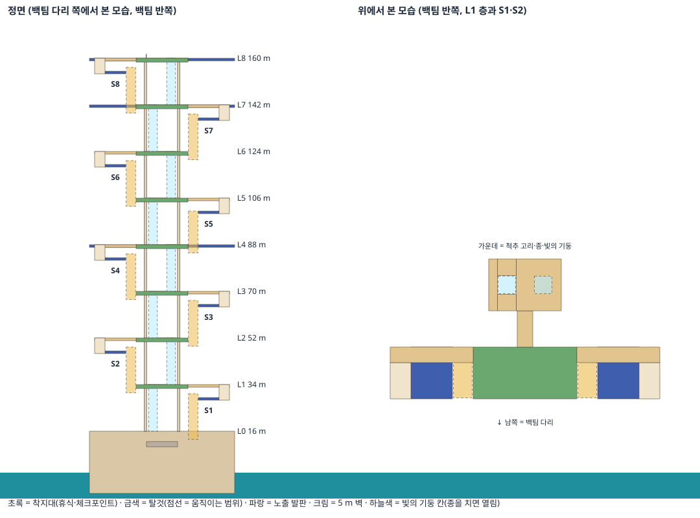

# 퀸 오브 더 힐 — 그레이박스 맵 (R48, 2026-09-27)

[DESIGN §3](DESIGN.md) "하늘 궁전"을 **실제 크기(160 m)의 상자 맵**으로 만든 것이다. 아트는 없다. 목적은 하나다: **오르는 시간 재기.** 구간 하나가 방해 없이 25~35초인지, 탑 전체가 약 4분인지 확인한다([DESIGN §3.8](DESIGN.md) 2단계).

**Unity에서 아직 열어 보지 않았다.** 확인 순서는 아래 §4와 [VALIDATION](../../Network/VALIDATION.md) 최상단 "퀸 오브 더 힐 그레이박스" 표.

## 1. 여는 법

Unity 위쪽 메뉴 **`ChessFight > Scenes > Queen of the Hill (offline graybox)`** → Play.

- 씬 파일(`Assets/Scenes/QueenOfTheHill.unity`)에는 카메라·조명·게임 루트·`Queen of the Hill Level`·`Playtest` 다섯 개뿐이다. **맵은 Play를 누를 때 코드가 만든다**(`QueenHillLevel`). 그래서 편집 화면(Scene 뷰)에는 맵이 안 보이고, Play 중에만 보인다.
- 캐릭터는 래그돌 폰(백팀). 오프라인 1인.
- 씬 파일은 `Tools/Generators/gen_queenhill_scene.py`가 만들었다. **맵을 바꾸는 것은 코드**(`QueenHillCourse`의 숫자, `QueenHillLevel`의 배치)이고, 씬 파일은 거의 고칠 일이 없다.

## 2. 조작

| 키 | 동작 |
|---|---|
| WASD · Space · Shift | 이동(카메라 기준) · 점프 · 전력질주 |
| 마우스 | 시점. **게임 화면을 한 번 클릭**하면 마우스가 잡힌다. Esc로 풀림. 휠 = 거리 |
| 좌클릭 / 우클릭 | 밀치기 / 잡기·벽 매달리기(우클릭 꾹 + W = 벽 오르기, Space = 벽 점프) |
| **E → 좌클릭 꾹 → 떼기** | 폰의 갈고리: 꺼내기 → 돌리며 게이지 → 게이지만큼 던짐. **다리 끝에서만** 던질 수 있다 |
| F | 종 치기, 승격 받침대, (적 갈고리 옆에서 꾹) 앙파상 |
| R / Backspace | 체크포인트로 / 처음부터(종도 모두 초기화) |
| **PageUp / PageDown** | 다음 / 이전 착지대로 순간이동(구간 하나만 반복 연습) |
| F11 | 종 초기화(열린 길 닫힘, 체크포인트 잊음) |
| **V** | 자유 카메라(WASD, Space 위, C 아래, Shift 빠르게). 다시 V = 캐릭터로 |

화면 왼쪽 위 = 조작 도움말, **오른쪽 위 = 구간 기록**(S1~S8 걸린 초, 합계, 계산 예상 234초), 아래 가운데 = 스테미나 막대.

## 3. 맵 구성

모든 숫자는 `Assets/Scripts/Core/QueenHillCourse.cs`에 있고 Core 테스트 2개가 지킨다(높이 160 m, 등반 ≤ 5.5 m, 갈고리 거리, 구간 18~36초, 전체 220~270초).

| 부분 | 내용 |
|---|---|
| 바다 | 수면 0 m. 빠지면 5초 둥둥 뜨다가 체크포인트(`WaterZone`) |
| 절벽 기단 | 56 × 56 m, 0 → **16 m**. 위가 0층 "갈고리 착지대". 절벽은 매끈해 헤엄쳐 붙을 수 없다(오를 수는 있지만 16 m라 스테미나가 모자람) |
| 다리 2개 | **+12 m**, 백팀 남쪽(−Z) / 흑팀 북쪽(+Z). 절벽 12 m 앞에서 부서져 끊긴다. 끝 14 m가 갈고리 던지는 곳(`HookStartZone`). 폰 6명씩 서는 자리(`SpawnPoint`) |
| 구간 S1~S8 | 18 m씩(16 → 160 m). **팀마다 자기 반쪽**을 오른다(흑팀 반쪽 = 백팀 반쪽을 180° 돌린 것). 구간마다 왼쪽·오른쪽을 번갈아 탑을 감아 오른다 |
| 한 구간의 길 | 초록 착지대 → **금색 탈것**으로 13 m → 파랑·금 체크 노출 발판 → **5 m 크림 벽**(S3 = L자 도약대, S4·S6·S8 = 사슬도 있음) → 꿀빛 통로 → 다음 착지대 |
| 가운데 척추 | 층마다 두 팀 착지대에서 통로로 이어지는 고리. **개척의 종**(층마다 1개, 두 팀 공용)과 **빛의 기둥 칸**(종을 친 구간의 고속 승강기, 18 m를 약 6초, 20초는 친 팀만) |
| 체크포인트 | 층 전체(1~8층)가 그 구간의 착지대. 다시 나오는 곳 = 가운데 고리. 규칙은 M9(내 최고 층 vs 팀 최고 층 − 1 중 높은 곳) |
| S4 · S7 · S8 | 두 팀 반쪽이 둘레 전체로 이어진다(첫 충돌 · 완전 합류 · 정상) |
| 정상 160 m | 문 기둥과 떠 있는 왕관(보기용), 팀마다 **승격 받침대 4개**(룩·비숍·나이트·킹, F). 퀸 보석판 자리 표시만 있다 |

**구간별 탈것**

| 구간 | 탈것 | 짧은 도전 | 계산 시간 |
|---|---|---|---|
| S1 폭포 테라스 | 승강 계단(발판 하나 13 m, 2.5 m/s) | 벽 5 m | 27초 |
| S2 사슬 곤돌라 | 체크 큐브 3개가 번갈아 5 m씩 | 벽 5 m | 31초 |
| S3 떠오르는 석판 | 석판 4개가 번갈아 4 m씩 | **L자 도약대**(또는 벽) | 29초 |
| S4 궤도 고리 | 도는 원판이 천천히 13 m | 사슬(또는 벽) | 30초 |
| S5 시계 태엽 | **태엽 스프링**: 5초마다 위의 모두를 13 m 위 발판으로 | 벽 5 m | 20초 |
| S6 공중 정원 | 부유섬 2개가 번갈아 7 m씩 | 사슬(또는 벽) | 32초 |
| S7 궁전 대발코니 | 승강 계단 | 벽 5 m | 27초 |
| S8 하늘의 문 | 빛의 승강기(3 m/s) | 사슬(또는 벽) | 25초 |

"번갈아"는 한 발판이 꼭대기에 있을 때 다음 발판이 바닥에 있어서(1 m 겹침) 옮겨 타는 박자다. 모든 탈것은 공유 시계의 함수라(결정 G2) 네트워크 비용이 없다.

신호 색: 초록 = 휴식·체크포인트, 금 = 움직임, 파랑·금 체크 = 노출, 크림 = 오를 벽, 하늘색 = 열린 길.

## 4. Unity 확인 순서 (처음 한 번)

1. `ChessFight > Scenes > Queen of the Hill (offline graybox)` → Play. Console에 빨간 오류가 없는지 본다.
2. 백팀 다리 끝에 폰이 선다. 게임 화면 클릭 → 마우스로 둘러본다. 앞에 절벽(16 m)과 그 위 탑이 보여야 한다.
3. **E → 좌클릭 꾹(게이지) → 떼기**로 절벽 가장자리에 던진다 → 끌려가 매달림 → 우클릭 + W로 올라선다.
4. 오른쪽 금색 발판(S1 승강 계단)을 타고 13 m → 파랑 발판 → 끝의 크림 벽을 우클릭 + W로 5 m → 통로로 돌아와 초록 착지대(34 m). 오른쪽 위 기록에 **S1 몇 초**가 찍힌다.
5. 가운데 고리의 금색 종 앞에서 **F** → 종이 흰색이 되고 S1 빛의 기둥 칸(하늘색 승강기)이 나타난다.
6. 계속 올라가며 구간 기록을 적는다. 막히면 **PageUp**으로 다음 층, **V**로 자유 카메라로 둘러본다.
7. 결과(구간별 초, 막힌 곳, 이상한 것)를 AI에게 알려 준다. 구간이 25~35초를 벗어나면 `QueenHillCourse`의 탈것 속도·박자로 맞춘다.

## 5. 알고 있는 빈 곳

| 항목 | 상태 |
|---|---|
| 편집 화면에 맵이 안 보임 | Play 중에만 만들어진다(의도). 나중에 구간 프리팹으로 바꿀 때 편집 화면 배치로 옮긴다 |
| **추락 규칙**: 탑이 층층이 쌓여 있어 떨어지면 아래층에 부딪힌다 | 플레이테스트에서는 **초속 15 m보다 빨리 떨어지고 아래에 땅이 있으면 물에 빠진 것과 같이** 0.6초 뒤 체크포인트로(`PlaytestSpawner.fallCatchSpeed`). 바다 위면 바다가 받는다. **경기 규칙으로 할지 사용자 결정 필요**(DESIGN §7) |
| 흑팀 쪽 | 만들어져 있지만 오프라인이라 사람은 백팀 하나뿐. 흑팀 반쪽은 V 자유 카메라로 볼 수 있다 |
| 열리는 길의 다른 종류 | 모든 구간이 빛의 기둥 칸만 연다. 사슬 사다리(S2)·대각선 레일(S3)·캐슬링 도개교(S4)·빛의 다리(S6)는 아직 없다 |
| 방해 요소 | 없음(시계추 위험물, 톱니 사이 점프 등). 먼저 시간부터 잰다 |
| 갈고리 조준 궤적 선 | 랩에서만 보인다(`LabGame`이 켬). 여기서는 카메라 가운데로 던진다 |
| 로비에서 이 모드 | 아직 "준비 중". 네트워크 래그돌(M14)이 생겨야 경기로 들어올 수 있다 |
| 아트 | 없음. 구간 시간이 맞은 뒤 [ART_CONCEPTS](ART_CONCEPTS.md) 이미지 A 방향으로 모듈을 바꾼다 |

## 6. 코드 지도

| 파일 | 역할 |
|---|---|
| `Scripts/Core/QueenHillCourse.cs` | 높이·구간·탈것 박자·예상 시간(Unity 없음, 테스트 대상) |
| `Scripts/Gameplay/QueenHill/QueenHillLevel.cs` | Play 때 맵 전체를 만든다. 바다, 절벽, 다리, 층, 척추, 종, 빛의 기둥 칸, 구간 길, 정상 |
| `Scripts/Gameplay/QueenHill/QueenHillPlaytestPanel.cs` | 구간 기록, PageUp/PageDown, F11 |
| `Scripts/Gameplay/Playtest/PlaytestSpawner.cs` | 오프라인 캐릭터. 팀 지정, 카메라 기준 이동·조준, 퀸 오브 더 힐 체크포인트 부활, 추락 처리, 스테미나 막대 |
| `Scripts/Game/OrbitCamera.cs` | 마우스 3인칭 카메라 + 자유 카메라(V) |
| `Scripts/Gameplay/Characters/ITeamMember.cs` | `ITeamAssignable`(팀 지정), `IStaminaReadout`(스테미나 읽기) — 래그돌 어댑터 `RagdollDriver`가 구현(조작·물리는 그대로) |
| 이미 있던 부품 | `MovingPlatform`, `LaunchPad`, `RopeLine`, `WaterZone`, `HookStartZone`, `SpawnPoint`, `Bell`, `OpenPath`, `SectionCheckpoint`, `QueenHillMatch`, `PromotionPad`(모두 `JY-ragdoll_v2`에서 옴) |
